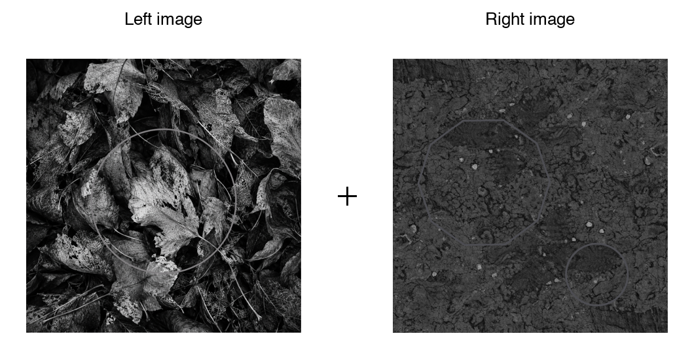
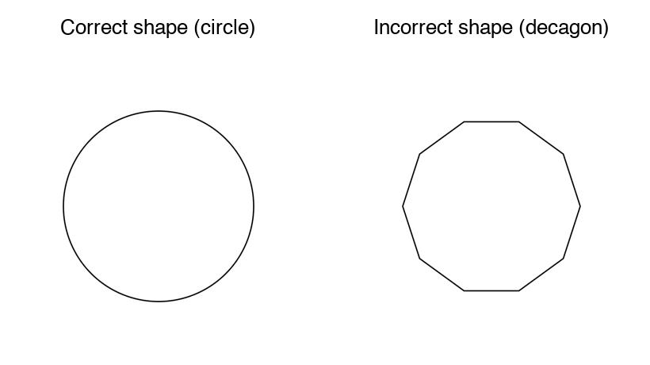

## Experimental Methods

### Participants

Data collection is ongoing. Eye tracking data were recorded from 16 participants; two were excluded from all analyses after quality control identified gaze calibration problems severe enough to make their data unusable (see Quality control below). The analyzed dataset includes the remaining 14 participants: 10 who selected a left to right (LTR) language (German or English) at the start of the session, and 4 who selected a right to left (RTL) language (Arabic or Persian). Within the LTR group, 8 participants chose English and 2 chose German; within the RTL group, 3 chose Persian and 1 chose Arabic. Group membership follows this self selected session language rather than a separate native language screening; participants were recruited as native speakers of the language they chose. Age, sex, and other demographic information will be added once collection is complete.

### Materials and stimuli

Stimuli were 16 images (000.png through 015.png), each a 1025 x 1025 px PNG, organized into eight fixed pairs. Each pair was shown six times across the session, and its position in this cycle ran independently of the six trial block structure described below, so a given pair was not tied to any particular story segment.

On each trial, the two images of a pair appeared at the same time on opposite sides of a central fixation point, along one of six axis orientations spaced 30° apart (0°, 30°, 60°, 90°, 120°, 150° from horizontal). This follows the arrangement used by Ehinger et al. (2026). Within a block of six trials, each of the six orientations occurred exactly once, in an order randomized per participant.

To keep participants engaged with both images rather than only the one they looked at first, they were asked to count the circular shapes in the pair, distinguished from a similarly sized decagon shown once during the instructions. The count could run from zero to three per pair. After each trial the experimenter entered the spoken count by key press; this count was not analyzed as a dependent measure, it served only to keep participants looking at both stimuli rather than disengaging once one had been inspected.

{#fig-stimulus-pair width="85%"}

{#fig-shape-examples width="70%"}

Alongside the eye tracking task, participants read a children's story (The Ugly Duckling) presented in nine segments. The first eight were shown one at a time, each before one six trial block; the ninth (the story's resolution) was shown once after the final trial, followed by five comprehension questions asked aloud by the experimenter and recorded manually. The story gave participants sustained exposure to text in their session language and a natural framing for the task; the comprehension questions served as an attention check rather than a scored outcome.

### Study design

The experiment used a between subjects design with reading direction group (LTR vs RTL) as the main factor. Each participant completed 48 trials in 8 blocks of 6, with one story segment shown at the start of each block. Within a block, the six trials sampled the six axis orientations in random order, so every participant saw every arrangement exactly 8 times over the session and arrangement is fully crossed with group rather than manipulated between subjects.

### Experiment (implementation)

The task was built in OpenSesame 4.1.14 ("Neonatal Nightingale") and run with a GazePoint GP3 HD eye tracker via PyGaze, sampling at 60 Hz (one sample every 16.7 ms). Viewing distance was fixed at 57 cm from a 1536 x 864 px display (33.8 x 27.1 cm). Before the main task, participants chose their session language from four options (Deutsch, English, Arabic, Farsi) with a number key; this choice set both the group assignment and the language of the story text and on screen instructions.

<!-- TODO: replace with a photo of the eye-tracking setup (participant seating, GP3 HD, display) once taken -->

The two images making up a pair were drawn from the same 1025 x 1025 px source files, shown at a fixed 0.25 scale so that each occupied roughly 256 x 256 px on screen. Together with the placement radius used for the six arrangements, this put the two image centers about 616 px apart at every orientation, far enough that the two areas of interest described below could never overlap.

{#fig-aoi-schematic width="90%"}

Each trial opened with a central fixation check: the script polled the tracker for up to 1.5 s for a gaze sample within 100 px of screen center, then continued regardless of whether fixation was reached. A fixed 1000 ms delay followed before the image pair appeared. Once the pair was on screen, the tracker was polled for 5000 ms; a gaze sample within 150 px of either image's center on both the horizontal and vertical axis was logged online as the first fixation, recording its side, latency, and coordinates, but the pair stayed visible for the full 5 s regardless of when a fixation was detected. Fixations were classified from the raw gaze stream by PyGaze's dispersion based algorithm, using a 1.5° dispersion threshold together with 35°/s and 9500°/s² thresholds on saccade velocity and acceleration to separate a fixation from the movement bringing the eyes to it. Calibration was performed once at the start of the session; PyGaze logged accuracy (mean offset from the calibration targets, in degrees and pixels, separately for each eye) and precision (root mean square sample to sample noise) automatically for every participant.

## Analysis methods

### Preprocessing

The first fixation on each trial was identified from the raw gaze stream rather than taken from the value logged online during the session, so that the same detection rule could be applied uniformly and independently of what the OpenSesame script happened to record live. GazePoint's own fixation classifier groups consecutive gaze samples into fixation events (identified by an FPOGID index, with normalized screen coordinates and a start time for each); these events were segmented into trials using the STIMULUS_ONSET and IMAGE_OFFSET markers written to the gaze log for that purpose. A fixation already in progress at stimulus onset was dropped before searching for the response, since it belongs to the preceding central fixation dot rather than to the stimuli that just appeared. Within the remaining window, the first fixation landing inside a 150 px square area of interest around either stimulus, on both axes, was taken as the trial's response, recording its side and latency; this is the same margin the experiment script used for its own online detection, applied here to tracker classified fixations rather than to individual raw samples.

Two subjects (43 and 44) were recorded before a display scaling fix was applied to the script, which left their online-logged first fixation side unusable: it registered a leftward or absent first fixation on all 96 of their combined trials, whereas the offline recomputation from the raw gaze stream found genuine rightward fixations for both of them. The offline recomputation does not depend on this part of the script and was used for every subject, not only these two, so the analysis pipeline is identical across the sample regardless of when a given participant was tested.

Trials were excluded when no fixation landed in either area of interest, or when the first fixation started less than 80 ms after onset, since a saccade that fast is planned before the stimulus appears rather than in response to it. No upper latency cutoff was applied. Slow first fixations were not random: they concentrated in arrangements without a stimulus in the upper left, so removing them would have removed a real part of the effect rather than noise; this pattern is examined on its own terms in the latency analysis below rather than treated as measurement error.

In the raw log, img_left and img_right label the stimulus on the seven-to-twelve o'clock side of an arrangement and the one on the one-to-six o'clock side, not the physical left and right of the screen; for the vertical arrangement in particular, neither stimulus sits on the horizontal meridian, so calling one of them "the right stimulus" would really mean "the bottom stimulus." To avoid this mislabeling, a trial's outcome was instead recoded as the clock hour fixated first, since the six arrangements are simply the six diameters of a clock face. Left/right and up/down bias were then derived from this hour, each skipping the one arrangement lying on the axis perpendicular to it (12 to 6 for left/right, 9 to 3 for up/down), since those two positions sit on the meridian itself and carry no information for that contrast.

### Quality control

Before analysis, each recording was checked for complete trial markers (48 stimulus onsets, offsets, and fixation dot events), image display duration close to the intended 5 s, and effective sampling rate close to 60 Hz with few gaps longer than 50 ms. Calibration quality was estimated per trial from gaze recorded during the central fixation dot: accuracy as the mean distance from screen center, and precision as the RMS spread around each trial's own mean. These were compared across subjects with boxplots and an x/y offset scatter to catch systematic drift, and a small number of trials per subject were plotted as full scanpaths to confirm that gaze actually landed inside the areas of interest and that the arrangement positions matched the intended layout.

This check identified two participants (61 and 107, out of the 16 recorded) whose data were excluded from all analyses. Participant 61's gaze during the central fixation dot was offset from screen center by a median of 485 px, more than 50% larger than any other participant's, and this offset was nearly constant across the session (interquartile range 8 px) rather than varying trial to trial as ordinary tracking noise would; scanpaths confirmed that the reconstructed gaze trace did not reach either stimulus's area of interest in any of the six arrangements, and only 8 of 48 trials registered a first fixation at all. Participant 107's calibration offset was smaller but still atypical (median 274 px, directed down and to the right of the true fixation point) and this participant was the only one in the sample whose first-fixation pattern was biased downward rather than upward. Across the other 14 participants (i.e., excluding both 61 and 107), an individual's calibration offset and their behavioral up/down bias were only weakly related (r = -0.20), so calibration drift does not account for the sample's bias in general; participant 107, however, had both the largest downward calibration offset of any participant, by more than a factor of two, and the single most extreme behavioral value in the sample, which together make a calibration artifact a more plausible explanation for this result than a genuine reversal of the group's attentional bias.

### Analysis pipeline

Preprocessing and analysis were carried out in Python 3.11, using pandas and numpy for data handling, scipy and statsmodels for the statistical tests, and matplotlib for the figures.

Group comparisons used a hierarchical bootstrap: subjects were resampled first, then trials within each resampled subject, since trials from the same subject are not independent and treating them as such would understate the true uncertainty. The point estimate is the unweighted mean of subject means, so that a subject with more valid trials does not automatically carry more weight; the confidence interval is the 2.5th and 97.5th percentile of 5,000 such resamples, drawn with a fixed random seed so the reported intervals are exactly reproducible from the same data. This procedure was applied to left/right and up/down fixation proportions per group, and to the full 12 hour clock-face profile.

A logistic regression in the style of a Bradley-Terry model estimated the log odds of fixating the clockwise-numbered stimulus first as a function of arrangement, entered as a six level categorical predictor, and reading direction group, giving a single test of whether the two groups differ once arrangement is accounted for rather than six separate group comparisons. With the current sample size some arrangement by group cells are close to or at perfect separation, which keeps the unregularized maximum likelihood fit from converging; where this happened, an L1 penalized fit was substituted, and its coefficients are reported as descriptive rather than tested for significance until more participants are added and separation is no longer an issue.

First-fixation latency was examined separately by arrangement and group, since the spatial bias also showed up as a difference in response speed rather than only in which side was chosen. The latency distribution is bimodal, with a fast mode around 250 to 350 ms and a slow tail extending past 2 s; because no upper cutoff was applied during preprocessing, this tail is available for analysis rather than discarded. The median latency by arrangement and group changes little, since the fast mode dominates almost everywhere, so the two groups were also compared on the share of trials falling in the slow tail, using 2 s (the approximate valley between the two modes) as a descriptive boundary rather than an exclusion criterion.