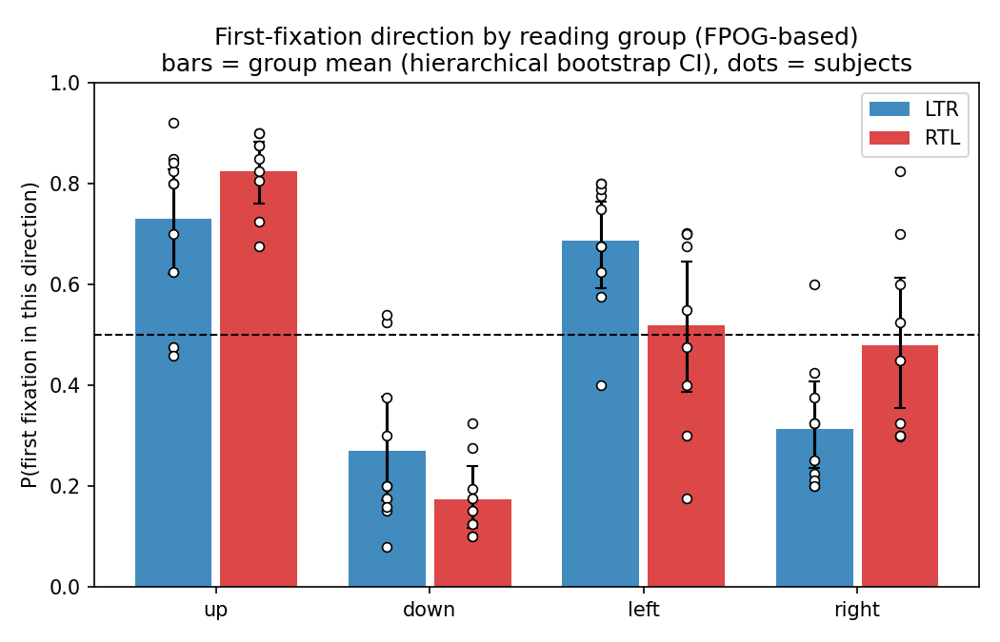
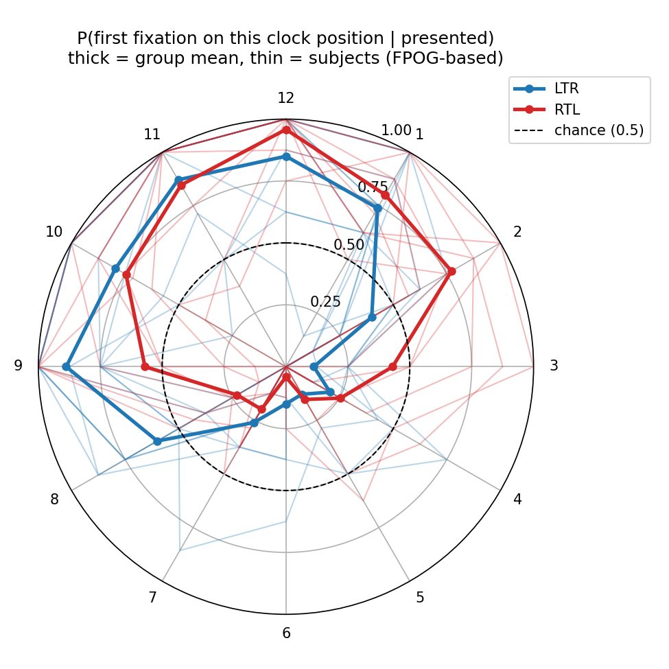
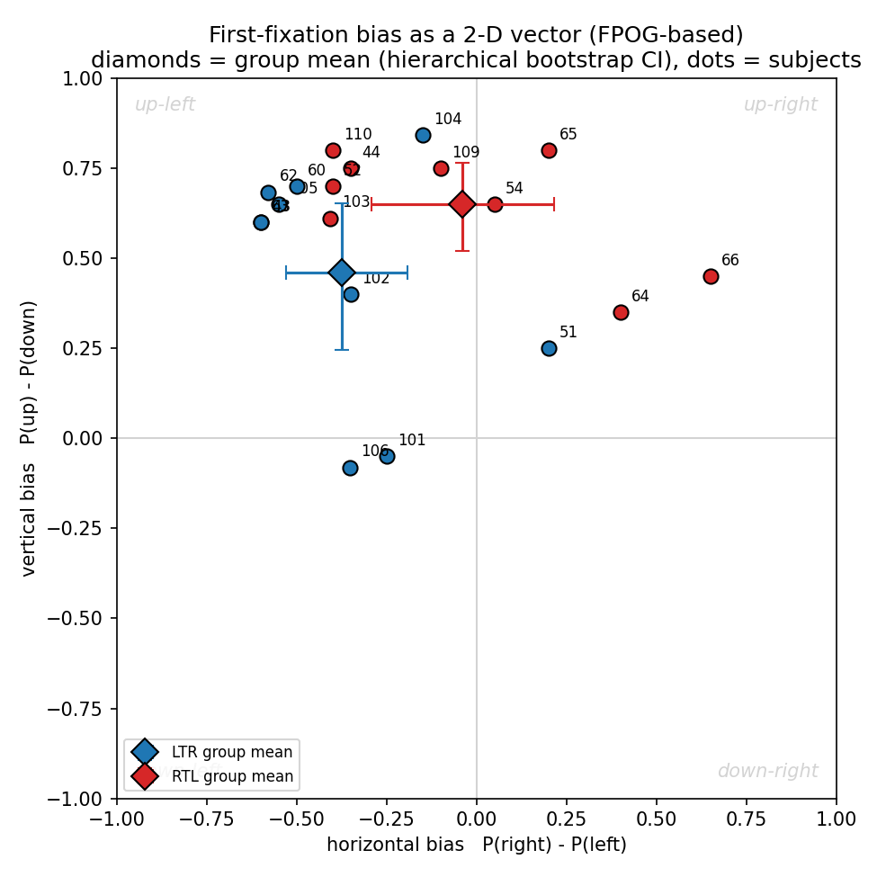
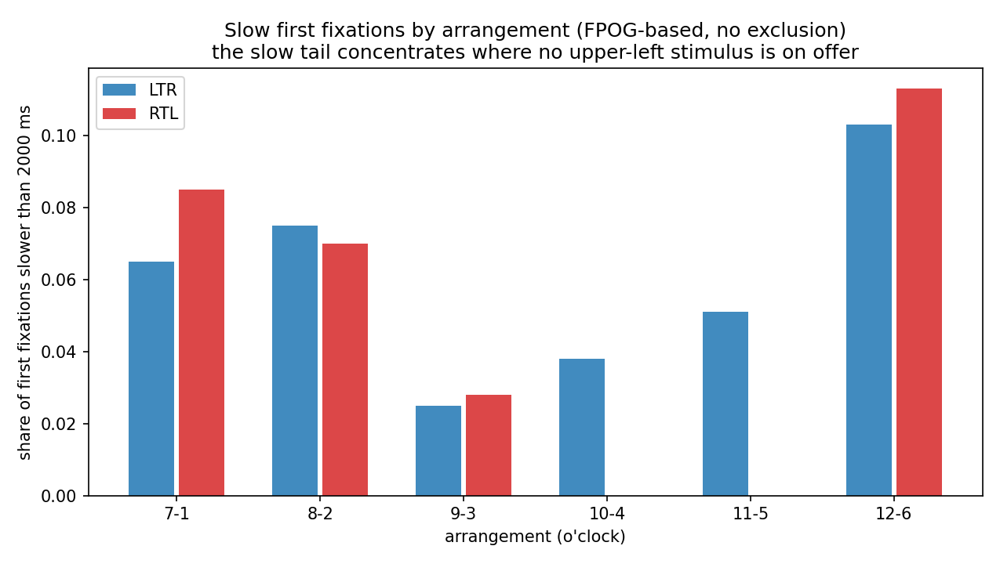

## Results

The 19 participants retained after exclusions (Methods) contributed 901 valid first fixations out of 912 trials: 10 LTR participants (473 trials) and 9 RTL participants (428 trials). The 11 dropped trials split into 7 first fixations faster than 80 ms and 4 trials with no fixation in either area of interest. All results below use the first fixation computed from FPOG, the tracker classified measure used throughout preprocessing. A sensitivity check against raw gaze samples instead of classified fixations, reported in Methods, leaves every conclusion here unchanged.

### Left/right and up/down bias by group

@fig-orientation-bias and @tbl-orientation-bias give the pooled proportion of trials on which each group's first fixation went left, right, up, or down, with hierarchical bootstrap confidence intervals. `physical_side` and `physical_vert` are the same clock-hour-derived columns from Preprocessing, each skipping the one arrangement that carries no information for that axis:

```python
def pooled_orientation_table(df, axis_col, positive_label, negative_label):
    rows = []
    for group, g in df.dropna(subset=[axis_col]).groupby("group"):
        arrays = [(sg[axis_col] == positive_label).astype(float).values
                  for _, sg in g.groupby("subject_nr")]
        p_pos, lo_pos, hi_pos = hierarchical_bootstrap_ci(arrays)
        rows.append(dict(group=group, direction=positive_label, n_subjects=len(arrays),
                          n_trials=len(g), p=p_pos, ci_lo=lo_pos, ci_hi=hi_pos))
        rows.append(dict(group=group, direction=negative_label, n_subjects=len(arrays),
                          n_trials=len(g), p=1 - p_pos, ci_lo=1 - hi_pos, ci_hi=1 - lo_pos))
    return pd.DataFrame(rows)


group_lr = pooled_orientation_table(df_valid_fpog, "physical_side", "right", "left")
group_ud = pooled_orientation_table(df_valid_fpog, "physical_vert", "up", "down")
group_dir = pd.concat([group_lr, group_ud], ignore_index=True)
```

| Group | Direction | P(first fixation) | 95% CI |
|:------|:----------|-------------------:|:-------|
| LTR | left  | 68.7% | [59.2%, 76.5%] |
| LTR | right | 31.3% | [23.5%, 40.8%] |
| LTR | up    | 73.0% | [62.2%, 82.9%] |
| LTR | down  | 27.0% | [17.1%, 37.8%] |
| RTL | left  | 52.0% | [38.6%, 64.6%] |
| RTL | right | 48.0% | [35.4%, 61.4%] |
| RTL | up    | 82.6% | [76.0%, 88.3%] |
| RTL | down  | 17.4% | [11.7%, 24.0%] |

: Pooled first-fixation direction by group (FPOG-based), with hierarchical bootstrap 95% confidence intervals. {#tbl-orientation-bias}

{#fig-orientation-bias width="85%"}

Both groups fixate up well above chance. On left/right, LTR does too, but RTL's raw proportion no longer distinguishes it from chance: its CI [38.6%, 64.6%] spans 50%. LTR's leftward bias (68.7%) sits inside the 60% to 93% range reported for comparable paradigms in the literature reviewed in the Introduction; RTL's (52.0%) is smaller and in the predicted direction, but barely so, and the two groups' CIs overlap by a wide margin, so this contrast alone cannot distinguish a real group difference from noise. The up/down contrast runs the other way: RTL's upward bias (82.6%) is if anything larger than LTR's (73.0%), which the Introduction's hypotheses did not specifically anticipate.

### Clock-face profile

@fig-clock-face breaks the same bias down by all twelve clock positions rather than collapsing to left/right and up/down. Each trial contributes to the two hours actually presented in its arrangement, so every hour's estimate is conditioned on having been on screen at all:

```python
rows = []
for _, r in df_valid_fpog.dropna(subset=["fixated_clock"]).iterrows():
    for h in r["arrangement"]:
        rows.append(dict(group=r["group"], subject_nr=r["subject_nr"], hour=int(h),
                          fixated=float(r["fixated_clock"] == h)))
clock_long = pd.DataFrame(rows)

subj_clock = (clock_long.groupby(["group", "subject_nr", "hour"])["fixated"]
              .agg(["mean", "count"]).reset_index())
group_clock = (subj_clock.groupby(["group", "hour"])["mean"]
               .mean().reset_index(name="p"))  # mean of subject means
```

Both groups trace a similar shape: fixation probability is highest for the top three to four hours (10 through 1) and lowest for the bottom two (5 through 7), consistent with the up/left preference already visible in the pooled proportions.

{#fig-clock-face width="80%"}

A few individual hours diverge more than the pooled contrasts suggest, although each hour rests on about eight trials per subject and is correspondingly noisier. At hour 2 (upper right), RTL fixates first on 77.2% of trials against LTR's 40.0%, RTL's largest single-hour lead over LTR anywhere on the clock. At hour 8 (lower left), the pattern reverses, by almost exactly the same margin: LTR leads 60.0% to 22.8%. Hour 6 (bottom, on the vertical meridian) is the most extreme point on the plot: LTR still fixates it first on 15.0% of trials, against just 3 of 71 for RTL.

### Individual-subject bias vectors

@fig-quadrant plots each subject as a single point: horizontal bias (P(right) minus P(left)) against vertical bias (P(up) minus P(down)), each rescaled from a 0 to 1 proportion to a -1 to 1 bias so that 0 means no preference:

```python
subj_rows = []
for (group, subj), g in df_valid_fpog.groupby(["group", "subject_nr"]):
    px = (g["physical_side"].dropna() == "right").astype(float).values
    py = (g["physical_vert"].dropna() == "up").astype(float).values
    subj_rows.append(dict(group=group, subject_nr=subj,
                           x=2 * px.mean() - 1, y=2 * py.mean() - 1))
quad_subj = pd.DataFrame(subj_rows)

group_rows = []
for group, g in df_valid_fpog.groupby("group"):
    side_arrays = [(sg["physical_side"].dropna() == "right").astype(float).values
                   for _, sg in g.groupby("subject_nr")]
    vert_arrays = [(sg["physical_vert"].dropna() == "up").astype(float).values
                   for _, sg in g.groupby("subject_nr")]
    px, px_lo, px_hi = hierarchical_bootstrap_ci(side_arrays)
    py, py_lo, py_hi = hierarchical_bootstrap_ci(vert_arrays)
    group_rows.append(dict(group=group, x=2 * px - 1, y=2 * py - 1,
                            x_ci_lo=2 * px_lo - 1, x_ci_hi=2 * px_hi - 1,
                            y_ci_lo=2 * py_lo - 1, y_ci_hi=2 * py_hi - 1))
quad_group = pd.DataFrame(group_rows)
```

{#fig-quadrant width="75%"}

Both group means fall in the up-left quadrant, though RTL's now only barely: its mean horizontal bias is -0.04. LTR's confidence intervals in both dimensions exclude zero, so LTR is reliably biased up and left as a group. RTL's vertical CI also excludes zero, but its horizontal CI [-0.29, 0.22] spans zero, so the group-level leftward lean cannot be distinguished from no preference on this measure alone, matching @tbl-orientation-bias. At the individual level, five subjects have a positive horizontal bias, a net rightward preference: LTR subject 51 (x = 0.20), RTL subject 54 (x = 0.05, the smallest lean of either sign in the sample), RTL subjects 64 (x = 0.40) and 65 (x = 0.20), and RTL subject 66 (x = 0.65), the largest rightward lean of any subject in either group. Two LTR subjects (101, 106) sit just below zero on the vertical axis (-0.05 and -0.08), the only two participants without an upward preference; every RTL subject shows a positive vertical bias (0.35 to 0.80).

### A single test of the group difference

The proportions above answer four separate questions (left/right and up/down, for each group) rather than the one question of primary interest: do LTR and RTL differ once each arrangement's own baseline preference is accounted for? Methods describes a logistic regression built for exactly this: the log odds of fixating the clockwise-numbered stimulus in each pair (`img_right`, the one-to-six o'clock member), as a function of arrangement (six levels) and group:

```python
import statsmodels.formula.api as smf

df_bt = df_valid_fpog.copy()
df_bt["y_right"] = (df_bt["fpog_first_fix_direction"] == "right").astype(int)
df_bt["arrangement_str"] = df_bt["arrangement"].astype(str)

bt_model = smf.logit("y_right ~ C(arrangement_str) + C(group)", data=df_bt).fit(
    disp=0, cov_type="cluster", cov_kwds={"groups": df_bt["subject_nr"]})
```

The model converges cleanly (n = 901); standard errors are clustered by subject, since trials from the same subject are not independent -- the same reason the proportions above use a hierarchical bootstrap rather than a plain proportion. Arrangement drives most of the fit: relative to the baseline arrangement, the two arrangements without an upper-left stimulus (7 and 1 o'clock; 8 and 2 o'clock) sharply raise the odds of fixating the clockwise-numbered member of the pair (b = 2.51, p < .001; b = 1.58, p < .001), two of the three arrangements with the largest slow latency tails below. The remaining two non-baseline arrangements (11 and 5 o'clock; 12 and 6 o'clock) lower it instead (b = -0.61, p = .009; b = -0.98, p = .026); only 9 and 3 o'clock does not differ from baseline.

Group falls just short of conventional significance: the RTL coefficient is b = 0.74 (cluster SE = 0.42, p = .080). Fit without clustering, the same coefficient comes out p < .001, which would look like a decisive group difference; that version treats all 901 trials as independent observations, which overstates precision given only 19 subjects, so it is not the one reported. The clustered result agrees with the descriptive picture in @tbl-orientation-bias: a difference in the predicted direction that the current sample, though closer to significance than before, still falls short of confirming.

An arrangement by group interaction, which would give each arrangement its own group comparison instead of one pooled test, was checked and not used:

```python
inter_model = smf.logit("y_right ~ C(arrangement_str) * C(group)", data=df_bt).fit(disp=0)
# converges now that every arrangement x group cell has at least one trial
# (the (12, 6)/RTL cell, previously empty, now holds 3 of 71)
```

Every cell is now populated, so the interaction model converges. It still isn't the reported result: with only 9 RTL subjects spread across twelve arrangement-by-group cells, and no clustered version of this model fit, its per-arrangement estimates aren't reliable enough to report alongside the clustered additive model above, which is what's used instead.

### First-fixation latency by arrangement

@fig-latency shows the share of trials with a first fixation slower than 2000 ms, separately by arrangement and group; 2000 ms is a descriptive boundary at the valley of the bimodal latency distribution, not an exclusion criterion:

```python
SLOW_MS = 2000

lat = df_valid_fpog.dropna(subset=["fpog_first_fix_rt_ms"]).copy()
lat["arrangement_lbl"] = lat["arrangement"].apply(lambda a: f"{a[0]}-{a[1]}")
lat["slow"] = lat["fpog_first_fix_rt_ms"] > SLOW_MS

med = lat.groupby(["group", "arrangement_lbl"])["fpog_first_fix_rt_ms"].median().unstack(0)
pslow = lat.groupby(["group", "arrangement_lbl"])["slow"].mean().unstack(0)
```

Median latency for both groups (`med` above) stays within 248 to 282 ms across every arrangement and is not shown here, since the fast mode dominates almost everywhere and the group difference lives in the slow tail (`pslow`) instead.

{#fig-latency width="85%"}

The slow tail concentrates in the three arrangements without an upper-left stimulus (7-1, 8-2, 12-6) for both groups. RTL's slow tail is somewhat larger than LTR's in two of the three: 8.5% versus 6.5% for 7-1, its largest gap anywhere, and 11.3% versus 10.3% for 12-6; the third, 8-2, now runs slightly the other way, with RTL's tail (7.0%) a touch below LTR's (7.5%). In the three arrangements that do offer an upper-left stimulus (9-3, 10-4, 11-5), both groups are fast and the slow tail nearly disappears, reaching exactly 0% for RTL in 10-4 and 11-5. Where the choice proportions above show only a direction consistent with a group difference, latency points the same way for 7-1 and 12-6: RTL takes longer than LTR specifically where its preferred upper-left target is unavailable, though the effect is not uniform across all three such arrangements -- 8-2 in fact runs slightly the other way. These are raw shares with no confidence intervals, and each RTL cell holds 71 or 72 trials, so they carry the same caveat about sample size as the proportions do.
